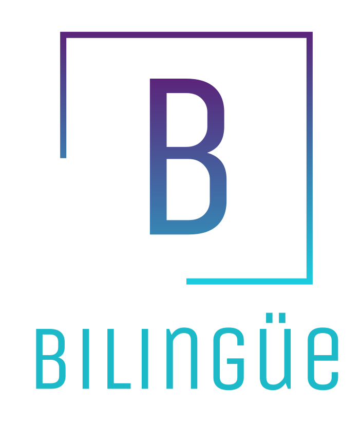

# bilingüe
[Open bilingüe](https://bilingue-skills.herokuapp.com/)

## Contents
* Objective
* Motivation
* Minimum Viable Product
* Stretch Goals
* ERD/Wireframes
* Screenshots
* Technologies Implemented
* Credits

### Objective
Language skills require maintenance. bilingüe gives all-in-one access to the tools you need to keep your Spanish language skills fresh.

------------------

### Motivation
I majored in Spanish in college. I worked with several Spanish speakers and was quite fluent by graduation. Living and working in an English speaking society, however, has made daily practice more difficult. I have notes scattered about of words to relearn or remember. I wanted a place to practice and maintain my skills that wouldn't get lost around the house.

-----------------

### Minimum Viable Product
* AAU I should be able to login/logout.
* AAU I should be able to keep a list of English words I want to find Spanish translations for and vice versa.
* AAU I should be able to update these cards with translations as I find them.
* AAU I should find links to Spanish language social media.
* AAU I should be able to see/add Spanish jokes/puns.

------------------

- [x] AAU I should be able to see/add Spanish media: movies, tv shows, books, music
- [ ] Add daily todo list
- [ ] Add travel info for Spanish speaking countries
- [ ] Daily vocabulary on login
- [ ] Link to Spanish/English dictionary API
- [ ] Link to Spotify API to play music
- [ ] Implement chat app to talk to other learners
- [ ] Add in-app games in Spanish

-----------------

### ERD/Wireframes

-------------

-------------

### Trello Board
[See Trello Board for bilingüe](https://trello.com/b/tH8x7cjf/biling%C3%BCe)

--------------------

### Screenshots

---------------

### Technologies 
* Python
* Django
* AWS-SDK
* HTML
* CSS
* PostgreSQL

-------------------

### Credits
#### Social Media Links
* [Spanish.academy](https://www.spanish.academy/blog/social-media/) 
* [Medium](https://medium.com/@oh_yeah_sarah/5-instagram-accounts-to-follow-if-youre-learning-spanish-3bbd13427af3)

#### Logo  [BrandCrowd](https://www.brandcrowd.com/)

#### Jokes/Chistes
* [Lingoda](https://blog.lingoda.com/en/10-spanish-jokes/)
* [FluentU](https://www.fluentu.com/blog/spanish/spanish-jokes/)
* [Fluent In 3 Months](https://www.fluentin3months.com/spanish-puns/)

#### Photos
* About page picture [CLC](https://www.clc.fr/blog/les-7-secrets-pour-devenir-bilingue/)
* Social Media Photos
  - [Phrase of the Day](https://www.dictionary.com/e/wp-content/uploads/2019/06/1000x700-spanish-1.jpg)
  - [Ruben Sebastian](https://www.instagram.com/rbnterrassa/)
  - [Llega Videos](https://pbs.twimg.com/profile_images/685020914220691456/uS6ZrMWV_400x400.jpg)
  - [Leonardo Pereznieto](http://www.fineart-tips.com/wp-content/uploads/2016/11/ML95Xrs.jpg)
  - [Human Spanish](https://www.swedishnomad.com/wp-content/images/2019/08/Spanish-Words-2.jpg)
 

[Open bilingüe](https://bilingue-skills.herokuapp.com/)